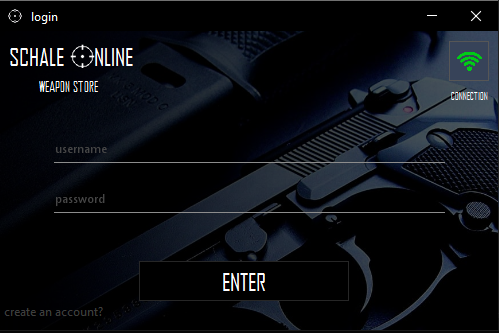
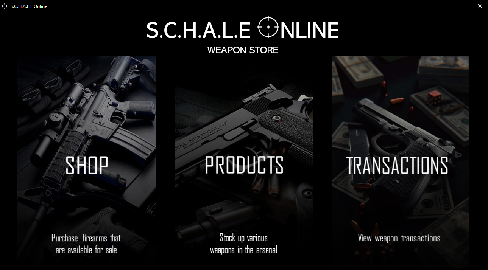
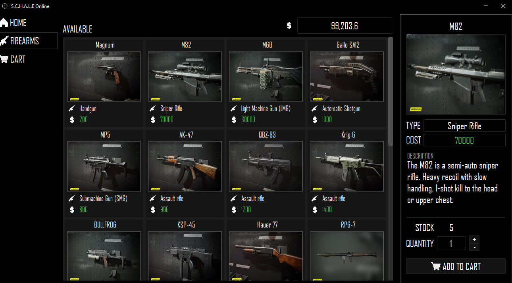
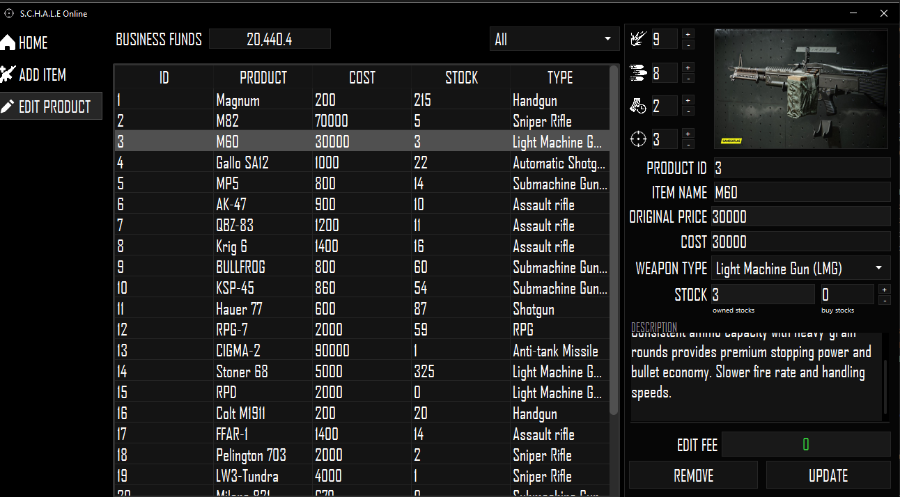
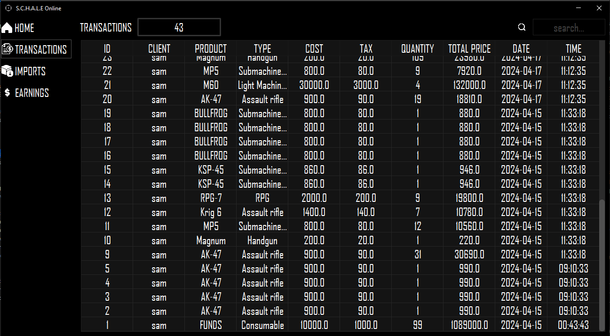
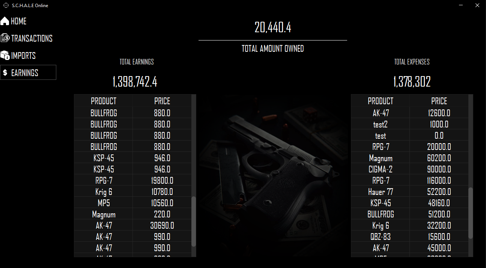

## Description
A Java-based Weapon Shop Inventory manangement System created using Swing GUI and SQL database integration using Xampp.

## Features
- User Authentication
- Product Catalog Viewing
- Product Purchasing Module
- Product Management
- Transaction History
- Administration Panel


## Requirements
- Java JDK
- Java IDE (preferably netbeans)
- xampp sql database


## Screenshots

### Login/Create Account
Login for added security to the application.

<div style="display: flex; gap: 10px;">


</div>

### Server Configuration
Set up the server to ensure secure sql database connections.


### Home Panel
Access all major features of the application, including viewing products, managing inventory, and checking transaction history.



### Shop
View and select the available products that you want to purchase.



### Products
Manage your product inventory by adding, editing, and deleting them.



### Transactions
Track your transaction history and  total earnings in the transaction panel.

<div>


</div>


## How to contribute
1. Clone this repository:
    ```bash
    git clone https://github.com/ImSauce/Schale-Online
    ```
2. Make changes and test
3. Submit Pull Request with comprehensive description of changes
